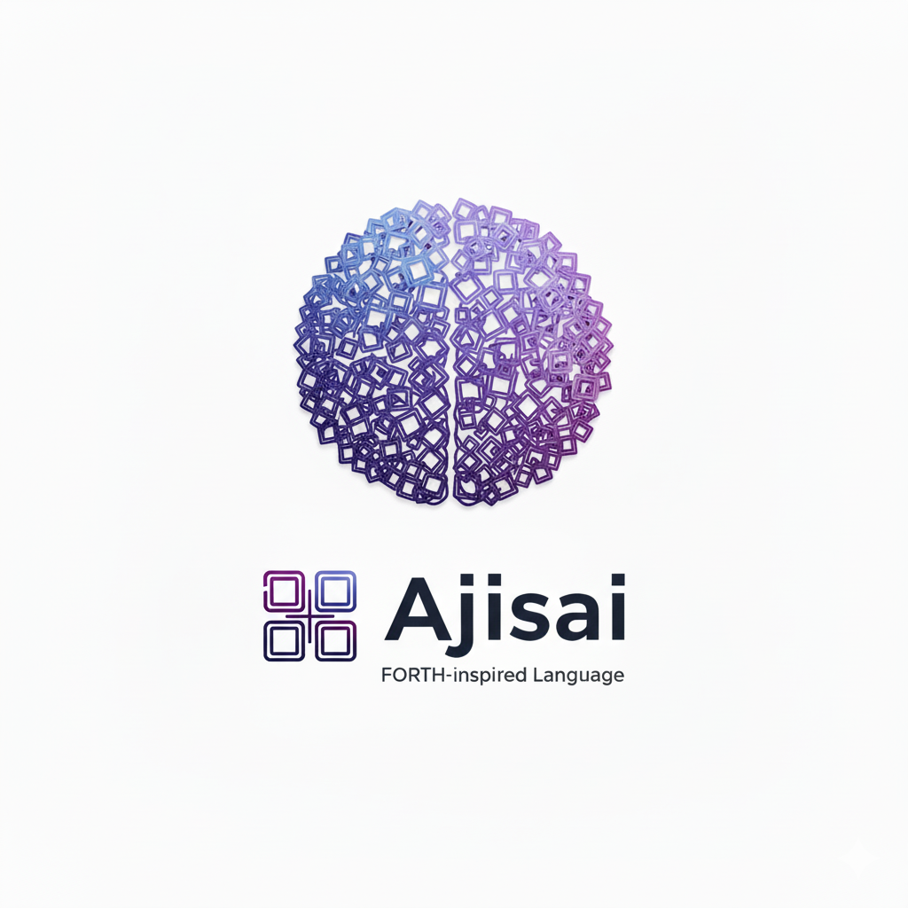

[](https://github.com/masamoto1982/Ajisai/actions/workflows/build.yml)




# Ajisai

紫陽花の学名は *Hydrangea* ——  
ギリシャ語で **「水の器」** を意味する。

Ajisai は **水の器であり、その水面に浮かべる波紋をおかしむ** プログラミング言語だ。  
器に水を満たし、流し、注ぎ分ける——値と計算はすべてこの水の中で完結する。  
そして水面に立つ波紋のかたちで、値の姿を読み取る。

この言語は、その名をそのまま設計の原理として引き受けている。

Playground: https://masamoto1982.github.io/Ajisai/

Desktop (Tauri) build channel is available in the same repository (`src-tauri/`).

---

## 水のメタファー

### 水としての分数

Ajisai の数はすべて分数である。近似しない。丸めない。  
水がどの器を通っても体積を失わないように、値は計算を通過しても変質しない。

→ 技術的な詳細: [SPECIFICATION.md §4.2](SPECIFICATION.md#42-scalar-exact-rational-arithmetic)

### 器としての Vector

Vector は器だ。値を順序をもって収める、形ある入れ物。  
器は入れ子にできる。器の中に器を置ける。  
それでも本質は変わらない——値を受け取り、保持し、渡す。

→ 技術的な詳細: [SPECIFICATION.md §4.3](SPECIFICATION.md#43-vector)

### 器に対する水の注ぎ方としてのコードブロック

器があれば、注ぎ方がある。  
コードブロックは「どのように水を注ぐか」を記述する——順序、変換、操作の連鎖。  
注ぎ方そのものも器に収められる。渡せる。別の注ぎ方に渡せる。

→ 技術的な詳細: [SPECIFICATION.md §4.6](SPECIFICATION.md#46-codeblock), [§8](SPECIFICATION.md#8-user-words)

### 水の流れを制御するモード

すべての操作は二つの軸で制御される。

**操作対象モード** —— 水路のどこに作用するか。水面の一点か、水路全体か。  
**消費モード** —— 流れは飲み込まれるか、それとも分流するか。  
分流（`,,`）は流れを失わない。源が残りながら、新たな流れも生まれる。

→ 技術的な詳細: [SPECIFICATION.md §6](SPECIFICATION.md#6-modifiers)

### 泡としての NIL

泡は水ではない。しかし水のある場所に現れる。  
NIL は値の不在——何かがあるべき場所に何もないときの形。  
`~` をつけた操作は乱流を泡に変える。氾濫は起きない。上流は守られる。

→ 技術的な詳細: [SPECIFICATION.md §4.5](SPECIFICATION.md#45-nil), [§6.3](SPECIFICATION.md#63-safe-mode-modifier)

### 波紋としてのセマンティックプレーン

水面に立つ波紋は、水ではない。  
しかし確かに水の上に浮かび、水の姿を観る者に伝える。  
セマンティックプレーンは値に添えられる表示のヒント——  
数として見せるか、文字列として見せるか、日時として見せるか。  
波紋は水の体積を変えない。流れを乱さない。計算にも影響しない。  
それでも値を読み取るその瞬間、波紋のかたちが見え方を決める。  
器に水を満たすだけでは言語は完成しない。水面の模様を立て、それを愛でる——そこまで含めて Ajisai だ。

→ 技術的な詳細: [SPECIFICATION.md §5.2](SPECIFICATION.md#52-two-plane-architecture), [§12](SPECIFICATION.md#12-semantic-plane)

---

## Runtime

Rust interpreter core → WASM boundary → TypeScript GUI/runtime shell

- Web Playground channel: Vite build (`npm run build:web`) for GitHub Pages
- Desktop channel: Tauri wrapper (`npm run tauri:build`, frontend via `npm run build:tauri-frontend`)
- Runtime-specific behavior (Persistence / File I/O / Runtime hooks) is abstracted via `js/platform/` adapters

仕様の完全な定義: `SPECIFICATION.md`

---

## Development Checks

```sh
cd rust && cargo test --lib
cd rust && cargo test --tests
npm run check
```

GUI 動作テストはアプリ上の `Test` ボタンから `js/gui/gui-interpreter-test-cases.ts` のケースを実行して確認します。

---

## Version / Branch Automation

- ヘッダーの `ver.` 表示はビルド時に埋め込まれたタイムスタンプを優先して表示されます（`__AJISAI_BUILD_TIMESTAMP__`）。
- 表示形式は `YYYYMMDDHHmm (change-note)` です（括弧は半角、`change-note` は kebab-case）。
- `変更内容` は次の優先順で決定されます。
  1. `AJISAI_CHANGE_NOTE`（kebab-case に正規化）
  2. ブランチ名（末尾セグメントを抽出して kebab-case 化）
  3. 直近コミットメッセージ（`Merge pull request ...` はマージ元ブランチ名を抽出）
  4. `update`

```sh
npm run build:web
AJISAI_CHANGE_NOTE="UI tweak" npm run build:web
```

- `AJISAI_CHANGE_NOTE` を指定すると、ヘッダーの `ver.` に `YYYYMMDDHHmm (ui-tweak)` のように表示されます。

---

## License

MIT (`LICENSE`)
